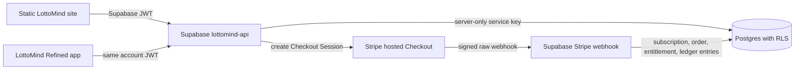

# LottoMind Secure Backend Architecture

## Boundary

The visual LottoMind site remains a static GitHub Pages artifact. Supabase Auth, Postgres, and Edge Functions own identity and account state. Stripe Checkout owns payment entry. Browser code never receives a Stripe secret, Supabase service-role key, collector-code hash, or authority to create credits.

## Account Tables

| Table | Authority | Client access |
| --- | --- | --- |
| `profiles` | Supabase Auth trigger and account service | Read own row |
| `subscriptions` | Verified Stripe webhook or collector redemption | Read own rows |
| `entitlements` | Verified webhook/redemption service | Read own active rows |
| `credit_ledger` | Server-authorized actions only | Read own entries |
| `collector_codes` | Redemption service only | No direct access |
| `game_reward_events` | Server-side game verifier only | Read own events |
| `orders` | Verified Stripe webhook | Read own orders |
| `downloads` | Entitlement-checked download service | Read own history |

Every exposed table has RLS. Policies use `to authenticated` and `(select auth.uid()) = user_id`. Browser roles receive no insert, update, or delete permission on account-value tables.

## Credits

`credit_ledger` is append-only. Its required contract is:

- `entry_id`
- `user_id`
- `amount_delta`
- `reason`
- `source_id`
- `idempotency_key`
- `created_at`

The balance is `sum(amount_delta)` and is calculated server-side across the complete ledger. A database trigger rejects updates and deletes, including privileged accidental mutations. Corrections use a new compensating entry. `spend_credits` serializes requests per user, checks the derived balance, and rejects repeated requests through `(user_id, idempotency_key)`.

The Ultra site and Refined app use the same `/account/snapshot` endpoint, so both receive the same verified ledger-derived balance. Local browser storage may cache a clearly marked offline snapshot, but it cannot change the verified balance.

## Payment Flow

1. The visitor signs in with Supabase Auth.
2. The browser sends its JWT and a server-known plan lookup key to `/billing/checkout`.
3. The Edge Function creates a Stripe Checkout Session and returns only a validated `checkout.stripe.com` URL.
4. Stripe collects payment details on its hosted page.
5. Stripe sends a signed raw request to `lottomind-stripe-webhook`.
6. The webhook verifies `Stripe-Signature` with `STRIPE_WEBHOOK_SECRET` before processing the event.
7. `checkout.session.completed`, subscription lifecycle events, and `invoice.paid` update orders, subscriptions, entitlements, and idempotent ledger grants.
8. Premium tools call `/entitlements/<tool-code>`; local UI flags are never sufficient authorization.

## Collector And Game Safety

Collector codes are normalized and SHA-256 hashed before database lookup. Redemption is atomic: a code row is locked, marked redeemed once, and produces a bounded subscription, entitlements, and an idempotent credit entry. Raw codes are never returned to the browser.

Local game scores cannot award LottoCredits. `/game-rewards/claim` remains fail-closed until a server-side game-event verifier is configured. A verified event must be unique, tied to a signed-in user, and recorded in `game_reward_events` before a ledger grant is appended.

## Isolated Staging Deployment

No live database change is part of this commit. The repository does not currently have the Supabase CLI or Deno runtime installed, and no isolated staging Supabase project is configured.

Owner deployment steps for an isolated test project:

1. Create or select a Supabase staging project used only by `upgrade-redesign` descendants.
2. Install and authenticate the Supabase CLI, then link only the staging project.
3. Apply `lottominded-ultra.io/supabase/migrations/20260805_secure_account_ledger.sql`.
4. Set server secrets from `lottominded-ultra.io/supabase/functions/.env.example`. Never put values in Git or browser scripts.
5. Deploy `lottomind-api` and `lottomind-stripe-webhook`.
6. In Stripe test mode, create the approved prices and populate `plan_catalog` with their `price_...` identifiers.
7. Register the webhook endpoint for `checkout.session.completed`, `customer.subscription.created`, `customer.subscription.updated`, `customer.subscription.deleted`, and `invoice.paid`.
8. Configure the staging static build with only the Supabase project URL and publishable key.
9. Verify signup, login, Checkout Sandbox cancellation, webhook idempotency, entitlement removal, collector-code one-time use, concurrent credit spends, and cross-client balance equality.
10. Keep staging payments/account writes disabled until those checks pass. Production remains unchanged until a later controlled release approval.

## Rollback

Application rollback uses `git revert`, never reset or force-push. Database rollout should be additive. If the backend must be disabled, remove the staging function routing and preserve ledger rows; never delete or rewrite credit history.
